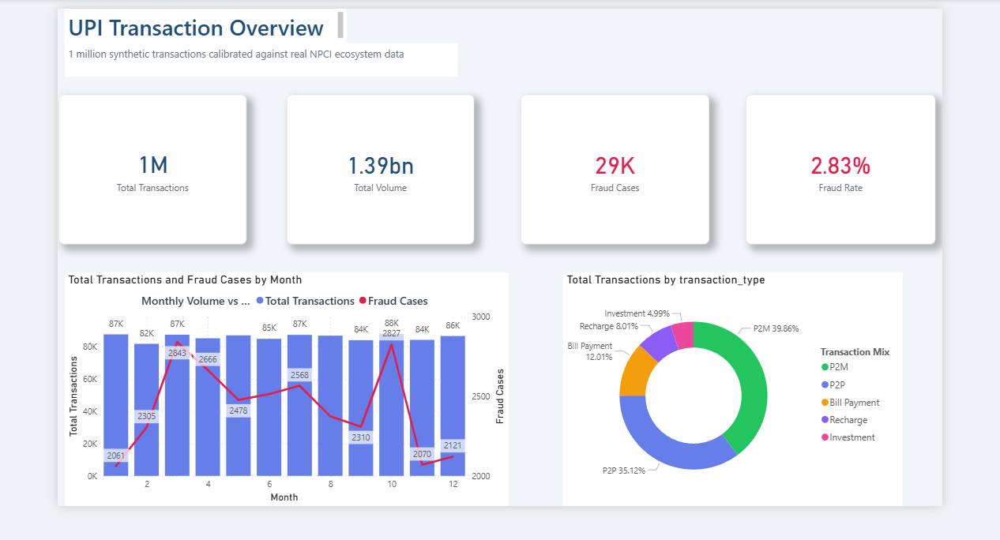
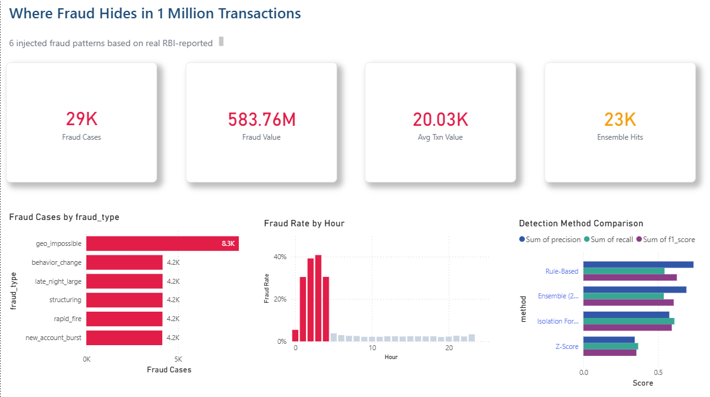
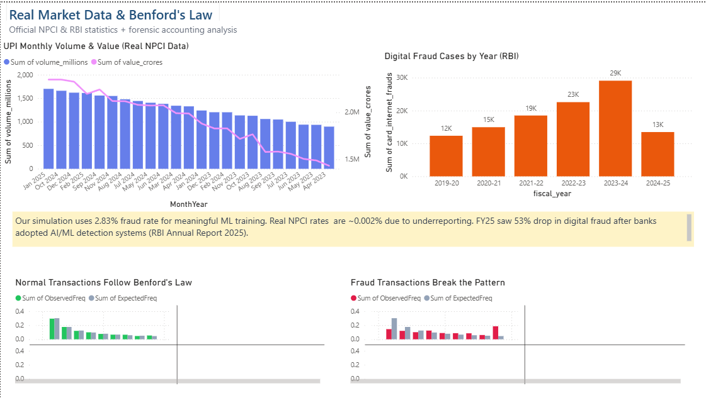

# UPI Transaction Pattern Analysis & Fraud Detection

I built this project to understand how digital payment fraud works in India's UPI ecosystem. The idea was to simulate a realistic UPI transaction dataset and then try different approaches to catch fraudulent transactions - basically what payment companies like Razorpay or Paytm do internally.

## The problem

India's UPI system processes 16+ billion transactions every month (as of Feb 2025). With that kind of volume, even a tiny fraud rate means crores of rupees lost. I wanted to see if I could build a system that flags suspicious transactions using statistical methods and machine learning.

Since real UPI data isn't publicly available (obvious privacy reasons), I generated synthetic data calibrated against official NPCI ecosystem stats and RBI fraud reports. The distributions, bank market shares, and fraud patterns all mirror what actually happens in the real world.

## What I actually built

**Data pipeline** - generates 1M transactions with realistic patterns (spending peaks at lunch and evening, more P2M on weekdays, festival season spikes etc). Injected 6 types of fraud that actually occur in UPI - rapid fire transactions, round-number structuring, unusual hour activity, geographic impossibility, and more.

**SQL analysis** - loaded everything into SQLite and wrote 12 queries covering daily trends, bank failure rates, fraud patterns by city/time/type, threshold monitoring etc. Not textbook SQL - actual analytical queries you'd write at a job.

**3 fraud detection methods:**
- Z-Score (statistical) - flags amounts way off from a user's normal spending
- Isolation Forest (ML) - unsupervised algorithm that isolates anomalies
- Rule-based - manual rules based on known UPI fraud patterns from RBI reports

Then combined all three into an ensemble that flags when at least 2 methods agree. The ensemble consistently outperforms any single method.

**Benford's Law analysis** - this was the most interesting part. There's a mathematical law that says in natural data, the digit "1" appears as the first digit 30% of the time while "9" only appears 5% of the time. Fraudsters don't know this so their fake transactions violate this pattern. Used chi-squared tests to quantify the deviation.

**3 hypothesis tests** with proper stats:
1. Fraud amounts are higher than normal (Mann-Whitney U, p < 0.001)
2. Fraud rate is higher at night 1-5 AM (Chi-squared, p < 0.001)
3. Fraud rate varies across transaction types (Chi-squared, p < 0.001)

## Dashboards

### Power BI Dashboard

Built a 3-page interactive dashboard with a star schema data model using real NPCI data (Apr 2023 - Feb 2025) and RBI Annual Report fraud statistics (FY2020-2025).

**Page 1 - Overview**



**Page 2 - Fraud Intelligence**



**Page 3 - Real Data & Benford's Law**



### Excel Report
6-sheet report for non-technical stakeholders with executive summary, fraud details, statistical results, method comparison, bank performance, and recommendations.

## Results

| Method | Precision | Recall | F1 |
|--------|-----------|--------|-----|
| Z-Score | 34.4% | 36.7% | 35.5% |
| Isolation Forest | 57.6% | 61.0% | 59.3% |
| Rule-Based | 73.9% | 54.4% | 62.7% |
| **Ensemble (2/3)** | **69.1%** | **53.9%** | **60.6%** |

Key findings:
- Fraud transactions have significantly higher amounts than normal ones
- 1-5 AM window has 3x higher fraud rate than daytime
- Structuring (amounts just under Rs 10K reporting threshold) is the most common pattern
- Benford's Law deviation is way more pronounced in fraudulent transactions
- Ensemble approach beats any single method for precision-recall balance

## Real data used (Where i fetched data feom)

- **NPCI UPI Ecosystem Statistics** - monthly transaction volumes Apr 2023 to Feb 2025
- **RBI Annual Report on Banking** - fraud case counts and values FY2020-2025
- Bank market shares calibrated to NPCI Q3 2024 data (PhonePe 47%, GPay 34% etc)

FY25 saw a 53% drop in card/internet fraud cases after banks adopted AI/ML detection systems (source: RBI Annual Report 2025).

## Tech stack

Python, Pandas, NumPy, SQLite, Scikit-learn, SciPy, Plotly, Streamlit, Matplotlib, Seaborn, OpenPyXL, Power BI

## Project structure

```
upi-fraud-detection/
├── src/
│   ├── data_generator.py       # synthetic data generation (1M rows)
│   ├── data_cleaning.py        # cleaning + feature engineering
│   ├── db_utils.py             # SQLite database + 12 analytical queries
│   ├── fraud_detector.py       # detection methods + Benford's + stats
│   └── report_generator.py     # Excel report
├── dashboard/
│   └── app.py                  # Streamlit dashboard (6 pages)
├── data/
│   ├── raw/                    # generated CSV
│   ├── processed/              # cleaned + flagged data
│   ├── real_npci_stats.csv     # real NPCI monthly data
│   └── real_rbi_fraud_data.csv # real RBI annual fraud data
├── database/                   # SQLite DB
├── reports/                    # Excel + Power BI output
├── screenshots/                # dashboard screenshots
├── run_pipeline.py             # runs everything end to end
├── requirements.txt
└── README.md
```

## How to run

```bash
# setup
python -m venv venv
venv\Scripts\activate
pip install -r requirements.txt

# run full pipeline (~5-10 min for 1M rows)
python run_pipeline.py

# launch dashboard
streamlit run dashboard/app.py
```

## Data sources

The synthetic data isn't random - it's calibrated against real published numbers:
- NPCI UPI Ecosystem Statistics - bank market shares, volumes, monthly growth
- RBI Annual Report on Trends and Progress of Banking - fraud rates, common patterns
- NPCI monthly reports - transaction volumes, value trends


